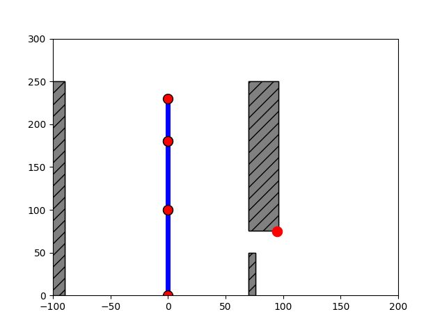

# Q-learning
## Maze
## Robot arm

### Given elements
- Arms: 3 arms connected with joints. Their lengths and possible rotations are configured. The first arm is jointed to the ground.
- Blockers: The area which should not be crossed by any part of the arms
- Goal position: the dx,dy positions which should be reached by the end part of the last arm.
- State: The arm's relative rotations in order. For example "15_-123_32" referes to the arms where the 1st arm is rotated 15° the second is rotated -123° and the last arm is rotated 32° relative to the previous arm. 0° means up, -90° means left, 90° means right and 180° means down.

